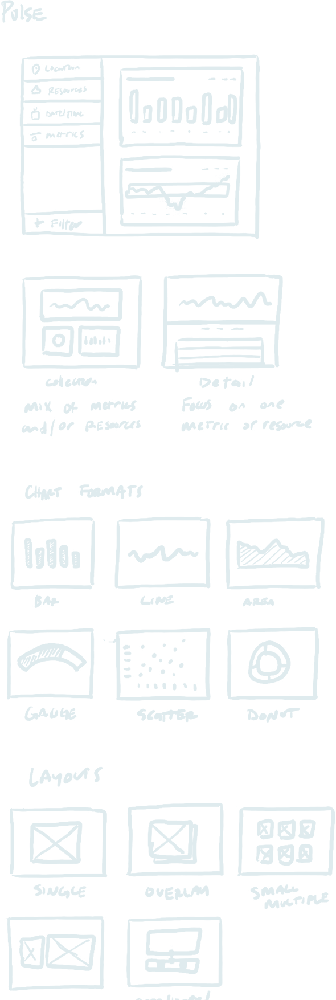
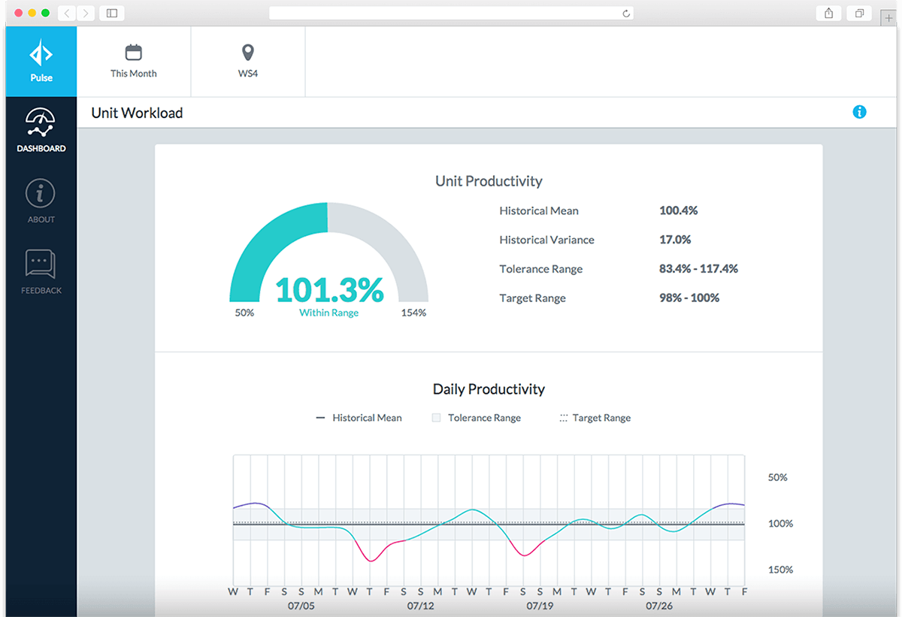

  

    
  

  

    <header class = "-push-one">so what was broken?</header>
    

      

        
In a word, magazines. None of the content was digital — it was all print. Kids Discover saw that the way to expand reach was through online subscriptions and content syndication. For obvious reasons, the current format was not going to support these growth opportunities. Kids Discover needed a partner to do a heavy lift — take all this offline content, organize it, architect both front- and back-end platforms and design user-friendly interfaces and then build it to support new business models in a scalable way. Easy peasy.

      

      
Not really. But we love a good challenge.

    

  

  

    

        <h6 class = "content__header -mobile-only">Research</h6>
        <header class = "-push-three">Okay, so how did andculture tackle the problem?</header>
        

            <h6 class = "content__header -desktop-only">Research</h6>
            

                
To dig into the education space, we held two teacher roundtable discussions, attended industry-related conferences, interviewed educational consultants and surveyed teachers across the country. We focus this qualitative and quantitative research on current and future states of education, access to technology in the modern classroom and other educational trends.

                
Once business needs were defined, we kicked off a second phase of research in 10 schools throuout the Northeastern U.S. Through observations and interviews, we learned how supplemental content is applied in the classroom and how students and teachers used and interacted with technology. With all of these findings, we were able to make informed product recommendations and start to write rules (e.g., “must make reading an active process”)

            

        

      

  

  

      

          

              
          

          

              
          

      

  

  

    <h6 class = "content__header -mobile-only">Takeaway</h6>
    <header class = "-push-three">What’s the common thread we’re seeing?</header>
    

      <h6 class = "content__header -desktop-only">Takeaway</h6>
      

        
We found that student research is a pillar in the modern classroom, and teachers were the gatekeepers in terms of accessing the K-12 market. The way teachers secured technology resources — both devices and software — varied greatly by school, but, clearly, teachers were the drivers. We needed to figure out how to target teachers individually and support them in sourcing and paying for our product, in order to drive adoption. Additionally, we needed to support a growing homeschooling population. We had to confirm that a student-centric version made sense to address both teachers and homeschoolers, in terms of user acquisition, value proposition and pricing.

      

    

  

    

  

    

      

        

          <header>Sketches become thumbnails. Thumbnails become mockups.</header>
          
What was once a loose concept from PinnacleHealth to give nurse managers a powerful scheduling tool was turning into a beautifully designed healthcare management experience.

          
Undoubtedly, healthcare’s regulations and incredible pace made this a unique challenge. But that only made us want to take even more care to ensure each detail was covered. We wanted to deliver a great experience, not just a scheduling tool. Well-designed experiences get used, day in and day out, even when things get hectic. And what hospital isn’t hectic?

        

        

          
        

      

      
    

  

  

    <h6 class = "content__header -mobile-only">User Testing</h6>
    <header class = "-push-three">One of the biggest challenges in designing an experience isn’t making the idea into a reality...</header>
    

      <h6 class = "content__header -desktop-only">User Testing</h6>
      

        
It’s getting people to use it! That’s why we gathered a small group of (brave?) initial users to try this new platform, something way out of the box compared to the static reports they had grown accustomed to. We needed to watch them use it, and they needed to see how we turned a bunch of spreadsheets into an accessible, chart-filled, problem-solving dashboard.

        
We observed. We interviewed. We met with nurse managers and administrators to discuss how they used the platform, and more importantly, what shortcomings it may have at this early stage. Was something confusing? Was a task more challenging to complete than we expected? 

        
A tip: Work with companies that don’t assume the first version of what they produced is perfect.* It should be about testing and evolving.

      

    

  

    

  

    <h6 class = "content__header -mobile-only">Next Steps</h6>
    <header class = "-push-three">Priorities and process moving forward</header>
    

      <h6 class = "content__header -desktop-only">Next Steps</h6>
      

        
Can we be candid? It was pretty f’ing cool to see the positive reaction of hard-working nurse managers knowing their job was made easier. But we weren’t done yet. Beyond the initial feedback, we needed to understand what was a functional priority for continued effectiveness, and what was simply additional value.

        
We didn’t want to lose a single valuable suggestion—all of those interviews matter—as these help us explore future feature expansions. It’s an ongoing process.

        
We’re not just dropping something we created in your lap and saying “best of luck!” That’s not a partnership. That’s a mother-in-law.

      

    

  

    

  

    <h6 class = "content__header -mobile-only">Iteration</h6>
    <header class = "-push-three">Evolving the system to increase effectiveness</header>
    

      <h6 class = "content__header -desktop-only">Iteration</h6>
      

        
We had initial user feedback plus data, and now we could update the platform design. We tweaked how the info was presented and modified the navigation. Charts were added to make the experience more comprehensive; you really could get a sense of how the entire hospital operated.*

        
We didn’t veer off our initial guiding principles. We just worked with our partner to evolve the system into an even more effective version to address their problem.

      

    

  

  

    <h6>Next project</h6>
    <h2>Commonwealth Charter Academy</h2>
  

