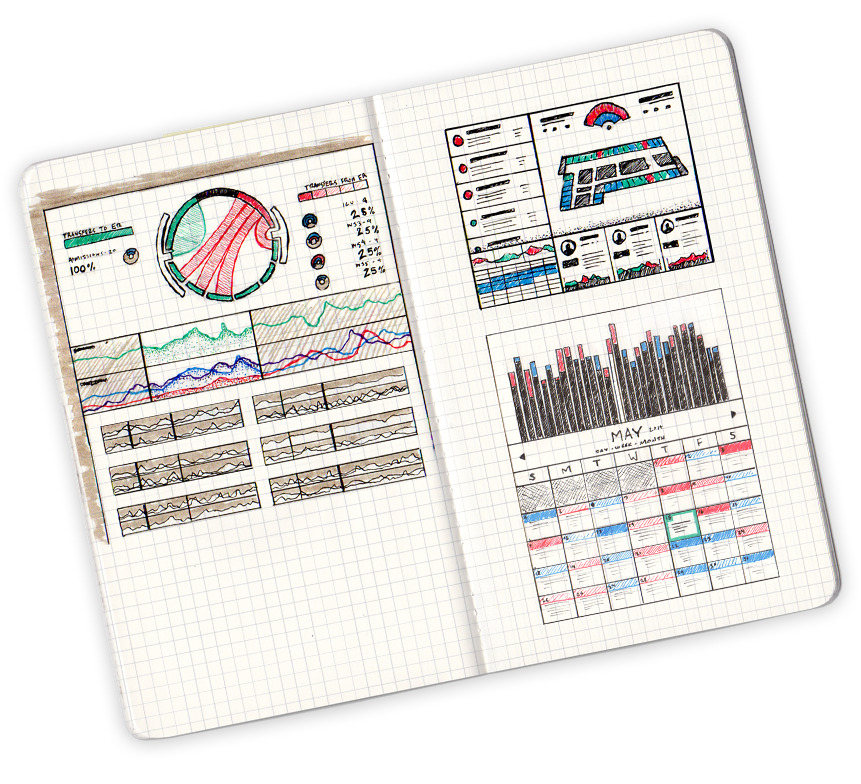
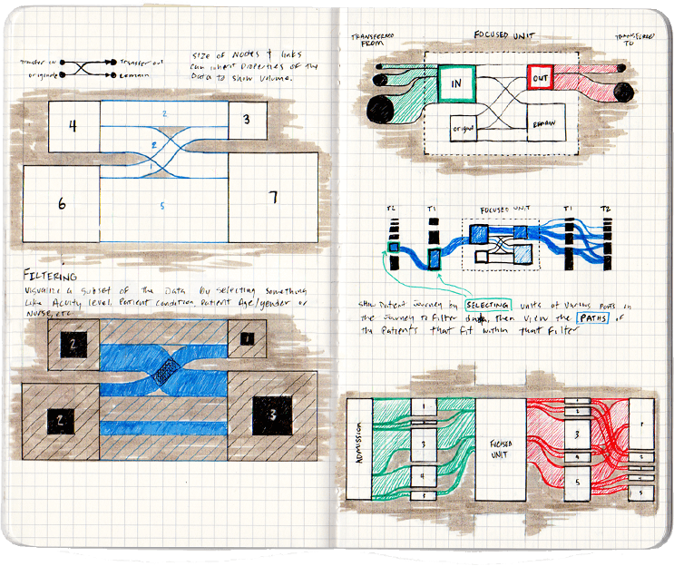

    

        

            <header>so what was broken?</header>
            
PinnacleHealth (now UPMC Pinnacle) needed a partner to turn static reports into a platform that could easily give nurse managers data to make scheduling their team second nature.

            
Nobody wants to walk into a hospital and realize they don’t have enough nurses. Having too many nurses around isn’t great for the bottom line, either. Without the 10,000-foot view of how adequate staffing has been in recent days and months, how could a nurse manager realistically fill up a schedule with any confidence? PinnacleHealth needed to be focused on providing excellent patient care, not scheduling staff. The right platform can do help you schedule staff more effectively so you can provide excellent patient care.

        

    

    

    

        <header>There’s a data side and a human side to this problem.</header>
        

            <h6 class = "research__header">Research</h6>
            

                
For data, we know a problem is easier to tackle if you can see it. We took what our partner provided and turned it into sketched concepts; we also input data into our visualization tools. Voila, now we could start to see shortcomings where before it was spreadsheets and hunches. 

                
The human side led to interviewing each nurse manager. How do they schedule? What tools do they use to do that? What about their job drives them up a wall?*

                
That’s not enough, though. So we met with people from other parts of the hospital system so we could get the full picture.

                
”Is your job just like on ‘Grey’s Anatomy’?” likely is one.

            

        

    

    
    

    
What's the common thread

Image

    
Colored background - Sketches become thumbnails...

    
Image

    
One of the biggest challenges

Image

    
Priorities and process

Image

    
Evolving the system to increase...

    
Next project

